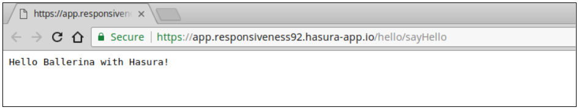

# Ballerina Meets Hasura

One of our technology partners, Hasura, has just rolled out their Ballerina integration.

Hasura is a platform to build and deploy microservices-based apps easily. One of the main features of the platform is that once you have your microservices ready, a simple “git push” will deploy them to the cloud - this is the simplicity that Hasura brings in. Now pair this with Ballerina’s ability to rapidly write feature rich and resilient microservices, and this becomes a combination that makes your microservices development, testing, and deployment a much more effective and seamless experience.

Let me take you through a quick tour of my experience in using Hasura with Ballerina. The first place you need to look at is [Hasura Hub](https://hasura.io/hub). Hasura Hub contains lots of quick starts for different programming languages and frameworks, that serve as a starting point for working with Hasura. A quick start is similar to a template project, which you can generate in your local machine and work with. 

I simply searched for “ballerina” in Hasura Hub, and it presented me with the result for the Ballerina quick start.

 
*Figure 1*

Clicking on the “**Clone and Deploy**” button gives you instructions on how to start working with  the project on your local machine.

 
*Figure 2*

The prerequisite of installing the Hasura CLI tool was completed with the instructions available [here](https://docs.hasura.io/0.15/manual/install-hasura-cli.html). It was just a matter of executing a single cURL command to get it downloaded and installed in my Linux based OS.

After this, I simply ran the `hasura quickstart hasura/hello-ballerina` command, which cloned a git project for a hello world Ballerina project to my local machine, and also set up a few other things, such as a remote Hasura cluster to work on.

 
*Figure 3*

Here, another key operation Hasura performs is generating a custom git remote location and adding it to my git repository. Now, if we do a push to this remote’s master branch, the project will automatically be built again from the source, and deployed automatically to the Hasura cluster that was set up earlier.

For my first deployment, I updated the hello-world Ballerina service, which is available at “microservices/app/src/hello_service.bal” in the project directory, to show a different output. Afterwards, I committed the changes, and did a git push to “hasura master”.

 
*Figure 4*

After the deployment is done, I executed the command `hasura microservice open app --path hello/sayHello` to open up the web browser to send a request to the Ballerina microservice.

 
*Figure 5*

The response is shown below: 

 
*Figure 6*

That’s it! It was a very pleasant experience from the beginning of the project to deploying it. You do not have to worry about your infra, tools and technologies to drive your CI/CD requirements as Hasura takes care of these things in a seamless manner. All I’ve to do to release a new app is change the source code, do a git commit and push. This automatically builds and deploys the new app instantly. 

Underneath, Hasura uses Docker & Kubernetes to make this magic work. So if you want more fine grained control, you can go ahead and edit the Docker/Kubernetes related configuration files in your repo for extended functionality. For example, the [QuickStart](https://hasura.io/hub/projects/hasura/hello-ballerina/adding-dependencies) contains instructions to add system and Ballerina related dependencies to your application.
